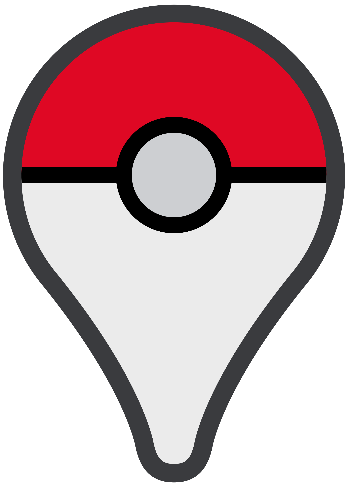
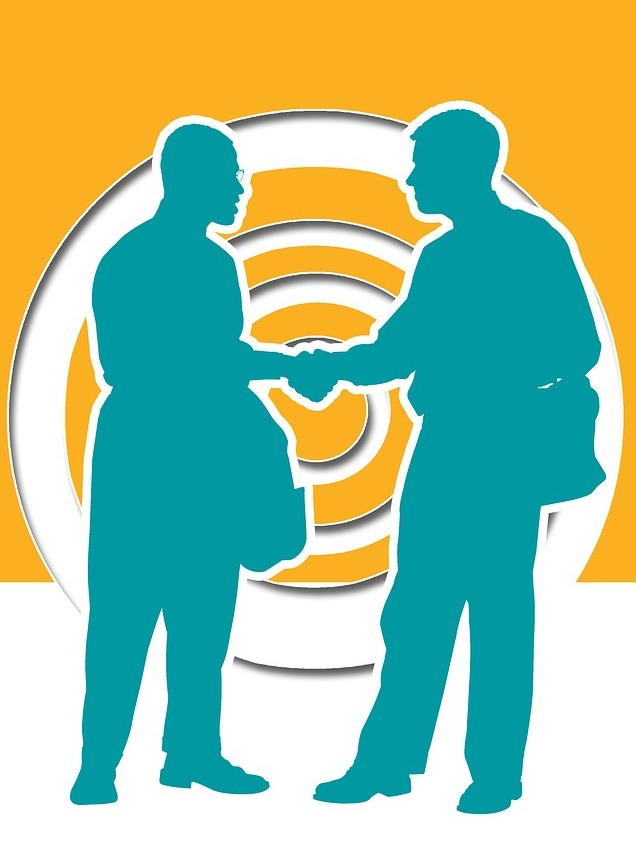
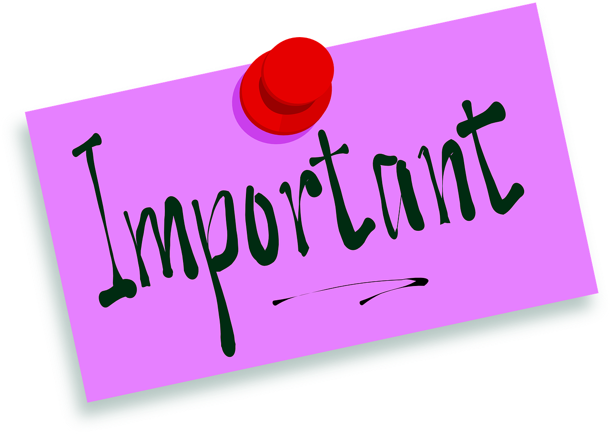
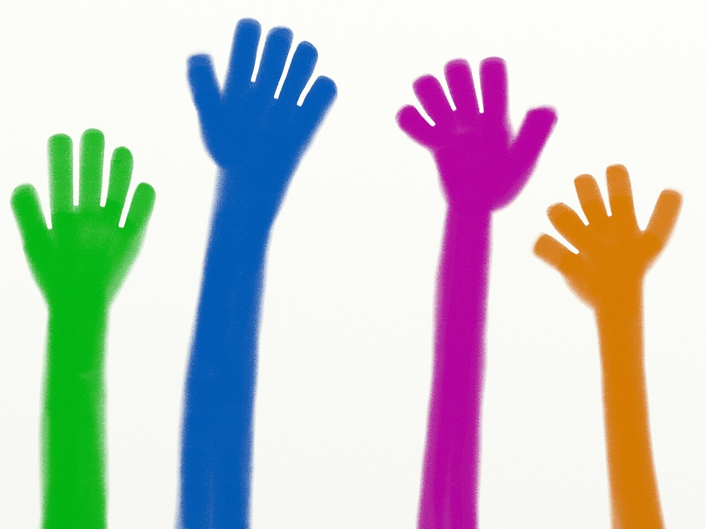

```{r, include = FALSE}
knitr::opts_chunk$set(echo = FALSE)
```


class: inverse, center, middle

# New Immigrants in Norway

---

.left-column[
## Who can Apply for Residency?
```{r}

```

]
.right-column[

**EU/EEA/EFTA:**
Not required but must register for residency

**Refugees for humanitetrian basis:**
Seek for asylum, also through UN system

**Family Immigration:**
Family reunion, marriage (_enough fund necessary_)

**Work:**
Work Permit

]


---

.left-column[
## Norwegian Language Requirement
```{r}

```

]
.right-column[
**Right and Obligation:**

* Refugees and Person on humaniterian ground
* Family member reuniting with:
  * Refugees or person on hunamiterian ground
  * Permanent Residence Holder and Citizen
* 600hr Norwegian language and 50hr of social studies
* Only for 16-67 years old

**Obligation:**

**Neither Right nor Obligation:**
]

---


.left-column[
## Norwegian Language Requirement
```{r}
knitr::include_graphics("images/language-requirement-2.png")
```
]
.right-column[
**Right and Obligation:**

**Obligation:**

* Migrant Worker outside EEA/EFTA
* Family of above people

**Neither Right nor Obligation:**

* Students
* Temporary Workers
* Scandinavian citizens
]

---
.left-column[
## Introduction Program
```{r}

```
]
.right-column[
### Object of Introduction program
* Employment and fininancial strengthen
* Norwegian Language and social insight

### Right and Obligation
* Refugees and Person on humaniterian ground
* Family members of above
* automomus residence permit due to domestic abuse
]

---
.left-column[
## Services
```{r}

```
]
.right-column[
### Tax (Skatteetaten)

### Population Register (Folkeregisteret)

### NAV
* Social benefits: child, sickness, unemployment, disability and pension

### Interpreter
]

---
.left-column[
## Participation
```{r}

```
]
.right-column[
### Language Training

### Finding Job
* NAV rigistration
* Building Network

### Know about right, obligation and opportunity
* Social Benifits
* Finding Information Resources

### Participating in various organizations
]